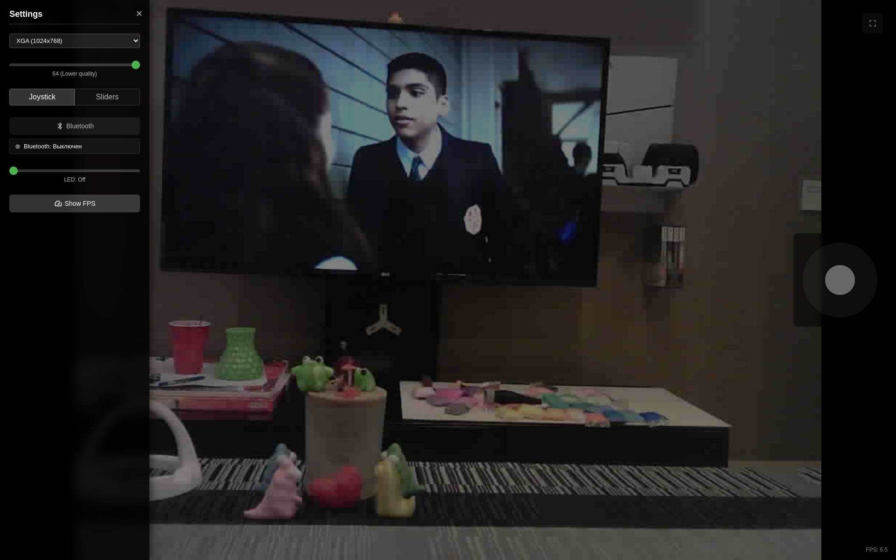
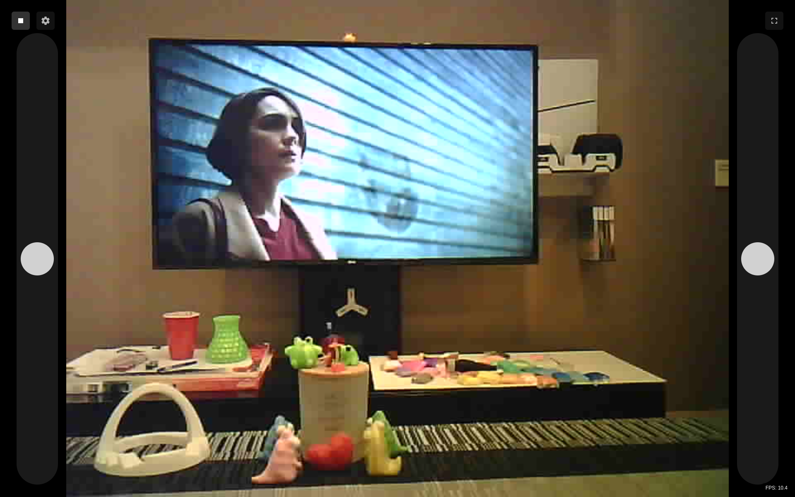
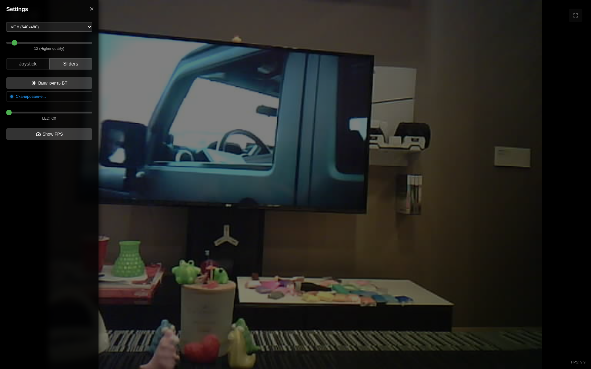

# Управление роботом ESP32-CAM с потоковой передачей видео



+English version: [readme.md](readme.md)

## Обзор

Этот проект реализует дистанционно управляемого робота на базе платы ESP32-CAM. Он обеспечивает потоковую передачу видео в реальном времени с ESP32-CAM и управляет двумя моторами. Роботом можно управлять через веб-интерфейс, используя виртуальный джойстик, ползунки для управления моторами или физический Bluetooth-контроллер. Веб-интерфейс также предоставляет элементы управления для настройки качества видео и регулировки яркости светодиода.

## Функции

* **Потоковая передача видео:** Передача видеопотока в реальном времени через HTTP multipart response
* **Управление двумя моторами:** Управление двумя моторами постоянного тока, обеспечивающее движение во всех направлениях
* **Несколько методов управления:**
  * **Джойстик веб-интерфейса:** Интуитивно понятное управление виртуальным джойстиком
  * **Ползунки веб-интерфейса:** Точное управление отдельными моторами
  * **Bluetooth-контроллер:** Поддержка физических Bluetooth-контроллеров (например, ExpressLRS Joystick)
* **Настраиваемые параметры видео:** Несколько вариантов разрешения (от QQVGA до UXGA)
* **Регулировка яркости светодиода:** Управление светодиодом на основе ШИМ
* **Мониторинг ресурсов:** Опциональная статистика задач FreeRTOS для анализа производительности
* **Переключение функций:** Легкое включение/отключение функций в конфигурации





## Архитектура

Проект построен на фреймворке ESP32 Arduino и использует FreeRTOS для многозадачности:

### Основные компоненты

* **Управление камерой (`camera_config.h`, `main.cpp`):**
  * Обрабатывает инициализацию и настройку камеры
  * Настраивает аппаратные пины и параметры камеры

* **Управление моторами (`motor_control.h`, `motor_control.cpp`):**
  * Управляет направлением и скоростью моторов через ШИМ
  * Обрабатывает входные данные от джойстика/ползунков с обработкой мертвой зоны
  * Реализует алгоритмы плавного ускорения и поворота

* **Веб-сервер (`http_server_task.h`, `http_server_task.cpp`):**
  * Обслуживает встроенный веб-интерфейс
  * Обрабатывает конечные точки API управления для моторов, настроек камеры и светодиода
  * Управляет запросами потоковой передачи видео

* **Потоковая передача видео (`stream_task.h`, `stream_task.cpp`):**
  * Захватывает и передает кадры камеры в формате MJPEG
  * Оптимизировано для производительности на ограниченных ресурсах ESP32

* **Управление Bluetooth (`bluetooth_task.h`, `bluetooth_task.cpp`):**
  * Сканирует и подключается к Bluetooth-контроллерам
  * Обрабатывает ввод с контроллера и преобразует в команды для моторов
  * Предоставляет обратную связь о состоянии подключения

* **WiFi-соединение (`wifi_manager.h`, `wifi_manager.cpp`):**
  * Управляет подключением к WiFi с обработкой переподключения
  * Использует учетные данные из переменных окружения

### Системная архитектура

* **Использование нескольких ядер:**
  * Веб-сервер и обработка UI выполняются на ядре 0
  * Потоковая передача видео и управление моторами выполняются на ядре 1
  * Задачи сбалансированы для оптимальной производительности

* **Встроенный веб-интерфейс:**
  * HTML/CSS/JS интерфейс сжат и встроен в прошивку
  * Нет необходимости во внешнем хранилище файлов
  * Интерфейс генерируется в процессе сборки из `data/html/index.html`

## Аппаратные требования

* Плата разработки ESP32-CAM
* Драйвер моторов L298N / L293D или аналогичный
* Моторы постоянного тока (2 шт.)
* Источник питания для ESP32-CAM (5В)
* Источник питания для моторов (в соответствии с вашими моторами, обычно 6-12В)
* Опционально: Bluetooth джойстик-контроллер (совместимый с ExpressLRS Joystick)

## Настройка и установка

### Предварительные требования

* PlatformIO IDE (рекомендуется)
* USB-to-TTL конвертер для программирования ESP32-CAM (или настроенная среда разработки ESP32)

### Конфигурация

1. **Настройки WiFi:**
   * Создайте файл `.env` в корневом каталоге:
   ```
   WIFI_SSID="ВАШ_WIFI_SSID"
   WIFI_PASSWORD="ВАШ_WIFI_ПАРОЛЬ"
   ```

2. **Выбор функций:**
   * Измените переключатели функций в `include/config.h`:
   ```cpp
   #define FEATURE_BLUETOOTH_ENABLED 1  // Установите 0 для отключения
   #define FEATURE_LED_CONTROL_ENABLED 1
   #define FEATURE_TASK_STATS_ENABLED 0
   ```

3. **Аппаратная конфигурация:**
   * Пины моторов и каналы ШИМ определены в `include/config.h`
   * Настройки светодиода можно изменить в `include/config.h`
   * Некоторые другие настройки также доступны в `include/config.h`

### Сборка и прошивка

**Использование PlatformIO:**
```bash
# Собрать проект
pio run

# Загрузить на ESP32-CAM
pio run --target upload
```

### Схема подключения

**Подключение драйвера моторов L298N:**
* **ESP32-CAM** → **L293D**
  * GPIO12 → IN1 (Левый мотор вперед)
  * GPIO13 → IN2 (Левый мотор назад)
  * GPIO15 → IN3 (Правый мотор вперед)
  * GPIO14 → IN4 (Правый мотор назад)
  * GND → GND
  * Питание моторов должно быть отдельным от питания ESP32-CAM

## Использование робота

1. **Подключение к роботу:**
   * Включите ESP32-CAM
   * Подключитесь к той же сети WiFi
   * Найдите IP-адрес ESP32-CAM в выводе последовательного монитора
   * Откройте веб-браузер и перейдите по IP-адресу

2. **Элементы управления веб-интерфейса:**
   * **Запуск/Остановка потока** - Начало/завершение потоковой передачи видео
   * **Режим управления** - Переключение между управлением джойстиком и ползунками
   * **Джойстик** - Перетаскивайте для управления направлением и скоростью
   * **Ползунки** - Регулируйте скорость левого и правого моторов по отдельности
   * **Настройки видео** - Изменение разрешения для улучшения качества или производительности
   * **Управление светодиодом** - Регулировка яркости встроенного светодиода
   * **Bluetooth** - Подключение к физическому Bluetooth-контроллеру

3. **Использование Bluetooth-контроллера:**
   * Включите Bluetooth в веб-интерфейсе
   * Включите ваш совместимый Bluetooth-контроллер
   * ESP32-CAM автоматически выполнит сканирование и подключение
   * Используйте контроллер для управления роботом

## Устранение неполадок

* **Проблемы с потоковой передачей видео:**
  * Уменьшите разрешение для более стабильной потоковой передачи
  * Обеспечьте стабильное подключение WiFi

* **Сбой подключения Bluetooth:**
  * Убедитесь, что ваш контроллер совместим
  * Проверьте имя BT джойстика в config.h 